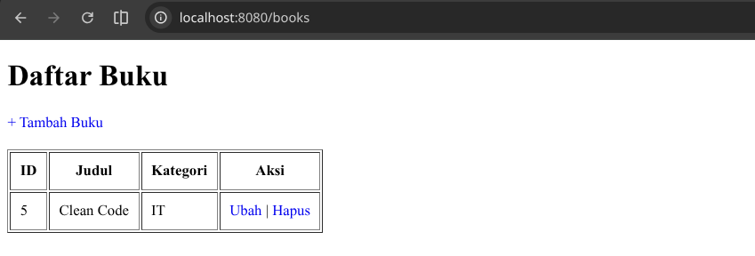
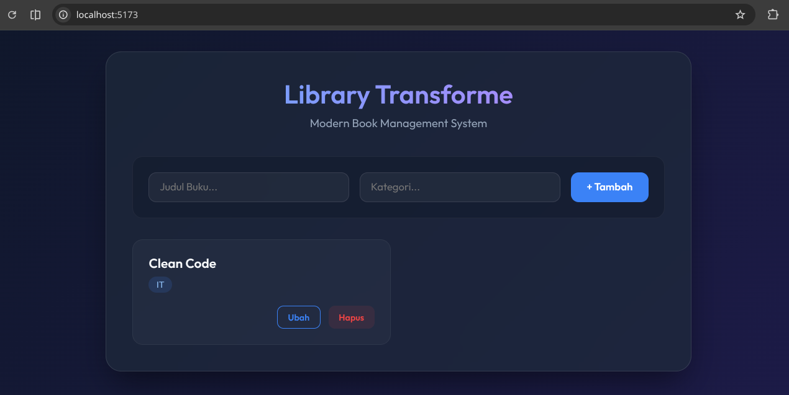
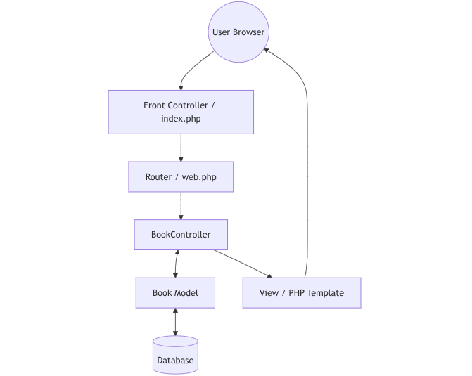
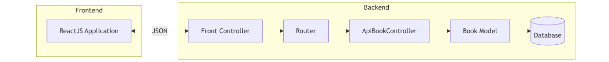

# 📚 Book Management System (Full-Stack PHP & React)

[](https://www.php.net/)
[](https://reactjs.org/)
[](LICENSE)

Project ini merupakan **Study Case** yang mendemonstrasikan dua pendekatan arsitektur web sekaligus dalam satu sistem:
1. **Classic MVC (Model-View-Controller)**: Implementasi murni PHP Native untuk manajemen logika bisnis dan penyajian halaman dinamis secara *Server-Side*.

   

2. **RESTful API Architecture**: Pemisahan Backend dan Frontend menggunakan **ReactJS** sebagai *Client-Side* dengan komunikasi data berbasis JSON.

   


   Pendekatan ini dirancang untuk menunjukkan pemahaman mendalam tentang fundamental *Full-Stack Development*, mulai dari pengelolaan database hingga interaksi UI modern.


---

## 🌟 Key Features

- **Frontend (ReactJS)**:
  - Modern UI dengan tema **Glassmorphism Dark Mode**.
  - Integrasi Full CRUD dengan Fetch API.
  - State management menggunakan React Hooks (`useState`, `useEffect`).
  - Responsif dan Interaktif.
  
- **Backend (PHP Native)**:
  - Arsitektur **MVC (Model-View-Controller)** murni tanpa framework.
  - Koneksi database menggunakan **PDO Singleton Pattern**.
  - Keamanan data dengan **Prepared Statements** (Anti SQL Injection).
  - RESTful API Ready dengan penanganan **CORS**.

---

## 🛠️ Tech Stack

- **Frontend**: ReactJS, Vite, Vanilla CSS (Modern Aesthetics).
- **Backend**: PHP 8.1+ (Native), PDO MySQL.
- **Tools**: VS Code, Xdebug, Postman, DBeaver.

---

## 📐 Architecture

### 1. Classic MVC Pattern Flow
Menunjukkan alur kerja internal aplikasi PHP dalam melayani permintaan halaman web (Server-Side Rendering).




### 2. Full-Stack Integration (REST API)
Menunjukkan bagaimana ReactJS berinteraksi dengan PHP Backend secara **Non-blocking**.



---

## 🚀 How to Run

### 1. Persiapan Database
1. Buat database baru bernama `library_db`.
2. Import file SQL atau buat tabel buku:
   ```sql
   CREATE TABLE books (
       id INT AUTO_INCREMENT PRIMARY KEY,
       title VARCHAR(255) NOT NULL,
       category VARCHAR(100) NOT NULL,
       created_at TIMESTAMP DEFAULT CURRENT_TIMESTAMP
   );
   ```

### 2. Jalankan Backend (PHP)
1. Masuk ke folder backend:
   ```bash
   cd book-management-native
   ```
2. Jalankan server internal PHP:
   ```bash
   php -S localhost:8080 -t public
   ```

### 3. Jalankan Frontend (React)
1. Masuk ke folder frontend:
   ```bash
   cd book-frontend
   ```
2. Install dependensi dan jalankan:
   ```bash
   npm install
   npm run dev
   ```
3. Buka browser di `http://localhost:5173`.

---

## 👤 Author

**n0tx** - [GitHub](https://github.com/n0tx)

---
*Project ini dibuat sebagai bagian dari persiapan interview teknis di PT Transforme Indonesia.*
